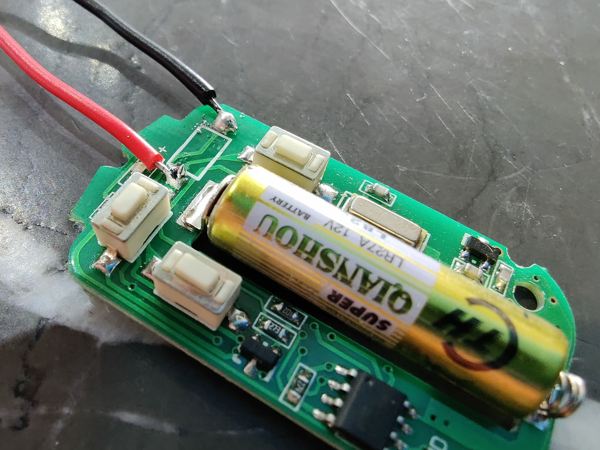
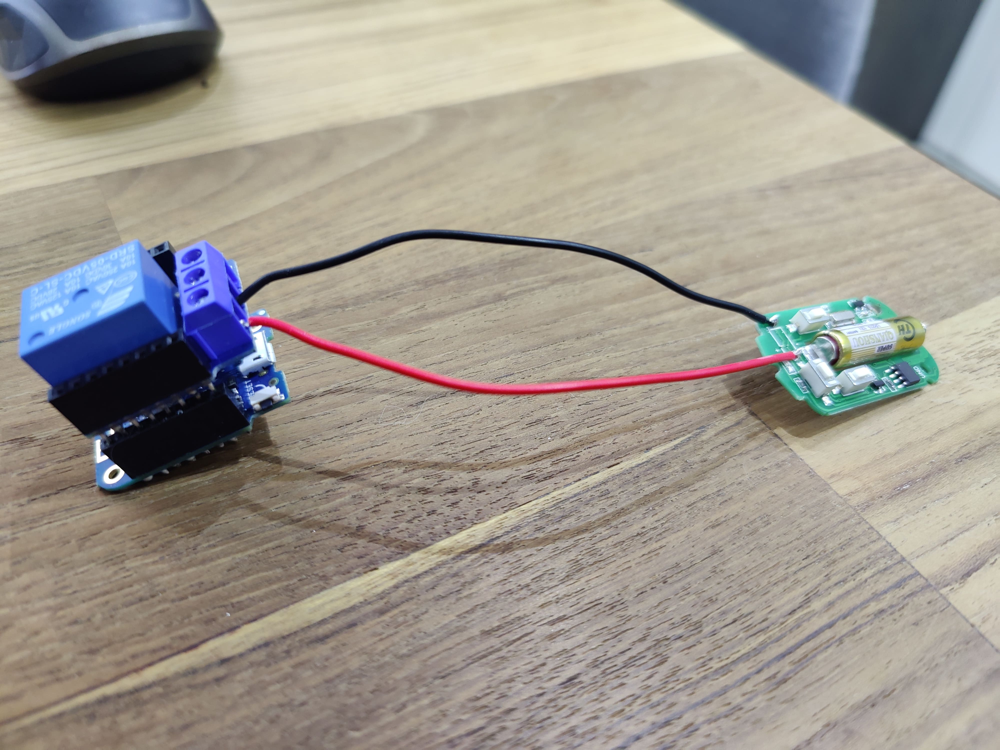
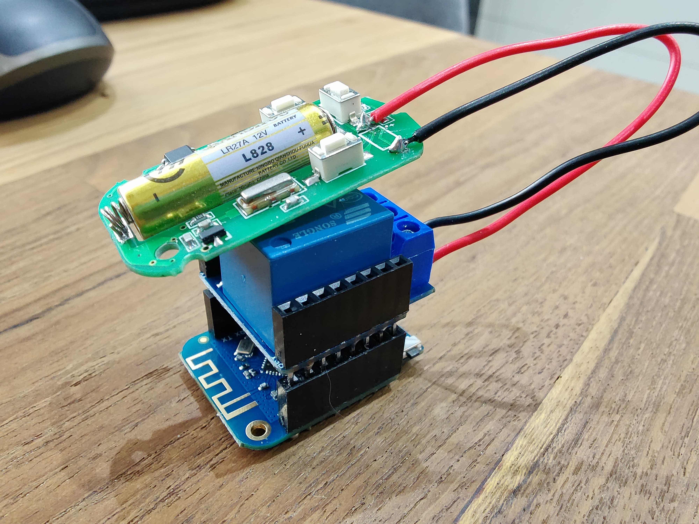
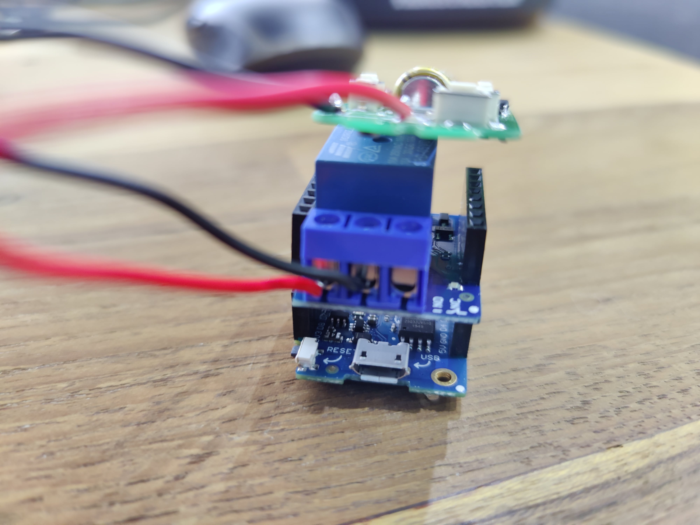

# ESP8266 Gate Opener

This sketch is for a simple ESP8266 WiFi Web Server that listens for requests to `/gate/press` and triggers a relay for 750ms. The ESP8266 is a low-cost Wi-Fi microchip, with a full TCP/IP stack and microcontroller capability. This means it's an ideal microchip for IoT Devices.

The sketch is found in [esp8266_gate_press.ino](esp8266_gate_press.ino)

## Components Used
* [LOLIN D1 mini](https://docs.wemos.cc/en/latest/d1/d1_mini.html) - The ESP8266 Board
* [D1 mini Relay Shield](https://docs.wemos.cc/en/latest/d1_mini_shiled/relay.html) - The Relay shield for the D1 Mini
* A spare Garage Gate Remote Controller

## How it works
The way this works is by taking a spare Garage Remote Controller (that works) and unsoldering the push button that opens the garage gate and instead soldering two wires; a red one from the `+` side of the circuit and the a black one on the `-` common side: 

Connect the Relay Shield to the D1 mini and connect the Red `+` wire to the `NO` (Normally Open) pin and the black `-` wire to the `COM` (Common) pin.
  